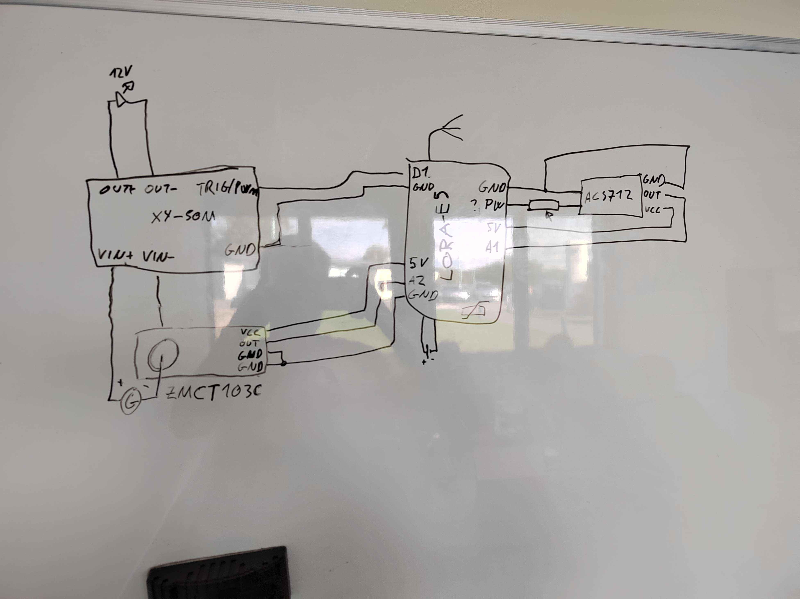

# Technical specifications
<b>Group 8</b>

## Project Scope

This project was proposed by SignAll, a French company that has been manufacturing large luminous signage since 1962. They supply a large number of customers such as McDonald’s, Burger King, La Poste, Orange, AXA, Crédit Agricole, Total, etc. to name a few.

Their existing products are not connected therefore users must be on-site to know if the signage is on, functional, or out of order. Also, users cannot switch the signage on/off remotely (even when the law requires them to switch it off at a given time, when the shop closes for instance).

When the owner of the brand on the signage is not the same as the owner of the place (think of a Burger Kind’s restaurant for instance), the maintenance team from the brand does not know what is going on at the place where the signage is installed and must go on-site on a regular basis just to check if everything is working. This results in additional costs and damage to the brand when the signage if out of order for too long.

Lately, environmental concerns and cost of energy has increased the pressure on the manufacturer to produce more efficient solutions such as dimming the signage when it is getting dark or switch it off completely at a given time or when there is a shortage of electricity.

In other words, this project need to manage a set of L.E.Ds in order to control these remotly. That control shall include turning those said L.E.Ds ON or OFF and being able to dim the light therefore reducing the energy comsumption. The device should also be able to work on is own, dim or turn OFF L.E.Ds at a given time of the day or depending of the ambiant light for exemple.

## Roadmap

- [ ] Setting up electronical model following the Technical Specifications
- [ ] Flashing the Lora-E5
- [ ] Progam Lora-E5 to read sensor data
- [ ] Progam Lora-E5 to control LEDs
- [ ] Progam Lora-E5 for PWM
- [ ] Etablish connection with TheThingsNetwork
- [ ] Set up protocol(s) for long range communication

## Electronical configuration

<s>This image is temporary.</s>

## Etablishing connection to the Lora-E5

## Software architecture

### Naming conventions

We'll be following the naming conventions described [here](https://www.golangprograms.com/naming-conventions-for-golang-functions.html).

- A name must begin with a letter, and can have any number of additional letters and numbers.
- A function name cannot start with a number.
- A function name cannot contain spaces.
- If the functions with names that start with an uppercase letter will be exported to other packages. If the function name starts with a lowercase letter, it won't be exported to other packages, but you can call this function within the same package.
- If a name consists of multiple words, each word after the first should be capitalized like this: empName, EmpAddress, etc.
- Function names are case-sensitive (car, Car and CAR are three different variables).

### Getting input data

How to read:

-Description-

| Title       |
| ----------- |
| Inputs      |
| Outputs     |

---

Reads the input from the ZMCT103C module to learn if the LEDs are powered by an outlet or not.
ZMCT103C outputs are in terms of mA (type float). In our case the output should be around 0.25A under power.

| isConnectedToPower() |
| ----------- |
| - |
| - bool isConnected |

---

Reads the input from the ACS712 sensor to read the ambient light level using a photoresistor.
For details on how to use the module look at [this example](https://www.electronicshub.org/interfacing-acs712-current-sensor-with-arduino/).

ACS712 outputs are in mV (type float). The expected voltage depends on the input voltage and the ambient light level. The output is to be normalised into a float between 0-1.

| getAmbientLightLevel() |
| ----------- |
| - |
| - float ambientLightLevel |

## Networking

