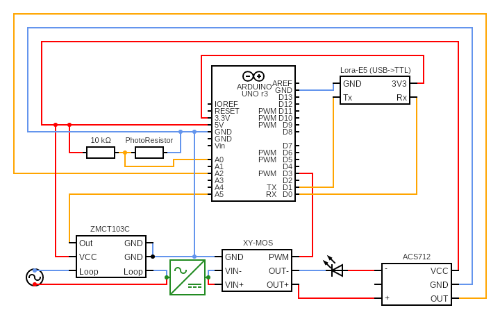

<h1 style="font-size: 2.5rem;">Technical specifications - Group 8</h1>

# Project Scope

The purpose of this project to create a product to function as a controller for outdoor LED signes.
The final product must be capable of:

- Turn the LEDs on and off.
- Dim the LEDs using PWM.
- Read the ambient light levels using a photoresistor and change the LEDs luminosity accordingly.
- Verify if the LEDs are powered.
- Verify if LEDs are functional.
- Count the amount of time the LEDs have been up.
- Connect to the LoRaWan network.
- Send status reports trough the LoRaWan network (such as estimated remaining LED liftime, error messages, etc.)
- Change device settings trough the LoRaWan network.
- Linking multiple devices together and shotting them all down in case of an error. 

The project must be realised using the TinyGo programming language. This is a limitation imposed by Algosup and we recommend C++ for the actual product as TinyGo has several limitations.
On the same note we also recommend a slightly different hardware, this will be detaild later on.

# Hardware

## Arduino Uno

Most everything in the project will be controlled using an Arduino Uno for the following reasons:

- It is easily accessible
- It is compatible with every other module used for the project (including the Lora-E5)
- It is compatible with TinyGo

## Lora-E5

We will attempt to control the final product trought the LoRaWan network.
We will be using a Lora-E5 for this purpose.

## XY-MOS

Switch used to turn the LEDs on/off.

## ZMCT103C

Sensor used to verify if the LEDs are powered.

## Photoresistor

Component used to measure ambient light.

## Materials used for testing purposes

- 12V LED strip
- GPV-18-12 AC/DC converter

# Recommended hardware

## Arduino MKR WAN 1310

This Arduino has an inbuilt system to connect to the LoRaWan network.
This means it could replace the Arduino Uno as well as the Lora-E5.
It could reduce the electricity usage of the product as well as severly simplify it.
Peer-to-Peer communication is also simplified with this micro controller.

Unfortunatelly, we had found out about thes contoller too late to actually implement it.

## DS3231 Real-Time Clock Module

The Arduinos inbuilt clock is both unprecise and temperature-sesitive.
Therefore we recommend the use of an RTC module with an integrated temperature-compensated crystal oscillator.

# Electronical configuration

This is how our model must be set up.

# Naming conventions

We'll be following the naming conventions described [here](https://www.golangprograms.com/naming-conventions-for-golang-functions.html).

# Software architecture

## readLoraDownLink()

Read data recieved from server if available.

## readSensorData()

Gather sensor data

## changeLocalData()

Set data to match freshly gathered information (both from downlink and sensors).

## setLeds()

Turns leds on and off depending on available data.

## sendLoraUplink()

Send report to the server trough the LoRaWan network

## isConnectedToPower()

Read the input from the ZMCT103C module to learn if the LEDs are powered by an outlet or not.
ZMCT103C outputs are in terms of mA (type float). In our case the output should be around 0.25A under power.

## getAmbientLightLevel

Read the ambient light level using a photoresistor and convert it into percentage.

## verifLeds()

Approximates LED status using output from a ACS712 low voltage sensor.

For details on how to use the module look at [this example](https://www.electronicshub.org/interfacing-acs712-current-sensor-with-arduino/).

ACS712 outputs are in mV (type float). The expected voltage depends on the input voltage and the power usage of the LEDs (hence why we should be able to verfy the leds using it).

# Testing plan

Dummy data must be created to replace downlink and sensory data.
The exact dummy data and its expected outputs are left to the discretion of the software engineer.

Tests must NOT be uploaded into the Arduino.

# Networking

The datastructure of the information packets sent and recieved by the Lora will need to be engineered to minimise the data packat size and therefore the data loss in transmission.
The data packats structure is as follows:

